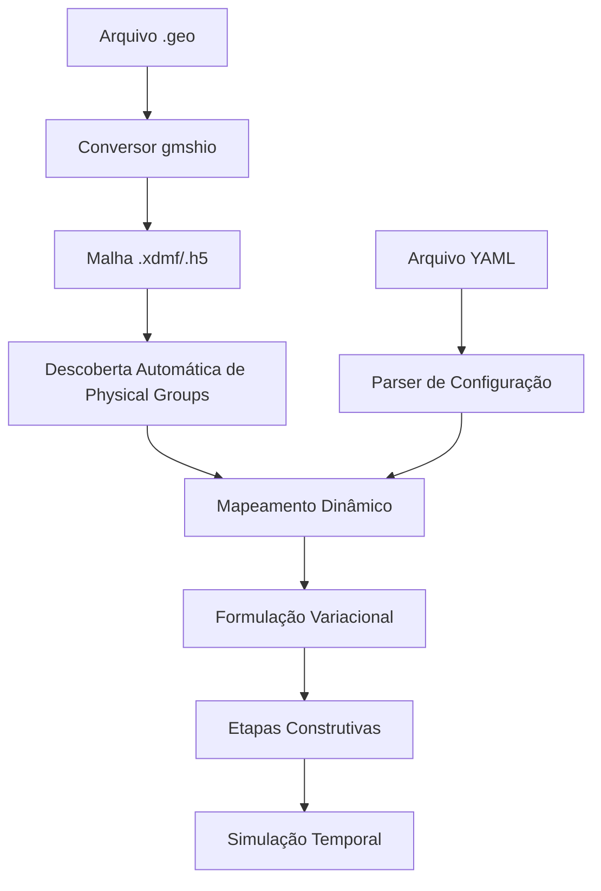

# Documentação Completa: Simulação Térmica FEniCSx Genérica

## 📋 Visão Geral

Este documento detalha a implementação de um **código FEniCSx completamente genérico** para simulação térmica de barragens com etapas construtivas. O código foi projetado para:

- **Descobrir automaticamente** Physical Groups da malha
- **Mapear dinamicamente** configurações YAML para elementos da malha
- **Implementar etapas construtivas** com birth/death de camadas
- **Ser reutilizável** para qualquer geometria e configuração

---

## 🏗️ Arquitetura do Sistema



---

## 📦 Importações e Dependências

### Seção 1: Imports FEniCSx Core
```python
import numpy as np
import yaml
from mpi4py import MPI
from petsc4py import PETSc
import dolfinx
from dolfinx import mesh, fem, io
```

**🔧 FEniCSx:** Esta seção importa os módulos principais do FEniCSx:
- `dolfinx`: Biblioteca principal para elementos finitos
- `mesh`: Manipulação de malhas computacionais
- `fem`: Formulação de elementos finitos
- `io`: Entrada/saída de dados

### Seção 2: Imports FEniCSx FEM
```python
from dolfinx.fem import FunctionSpace, Function, Constant
from dolfinx.fem.petsc import NonlinearProblem
from dolfinx.nls.petsc import NewtonSolver
```

**🔧 FEniCSx:** Imports específicos para formulação FEM:
- `FunctionSpace`: Define espaços de função para elementos finitos
- `Function`: Representa funções no espaço FEM
- `Constant`: Define constantes na formulação
- `NonlinearProblem`/`NewtonSolver`: Para problemas não-lineares

### Seção 3: Imports UFL (Unified Form Language)
```python
import ufl
from ufl import grad, dot, dx, ds, inner, TestFunction
```

**🔧 FEniCSx:** UFL é a linguagem de formas do FEniCSx:
- `grad`: Operador gradiente
- `dot`/`inner`: Produtos internos
- `dx`/`ds`: Medidas de integração (volume/superfície)
- `TestFunction`: Funções de teste para formulação fraca

---

## 🏛️ Classe Principal: GenericThermalFEniCSx

### Inicialização e Configuração

```python
class GenericThermalFEniCSx:
    def __init__(self, yaml_file, xdmf_file):
        """Inicializa solver genérico"""
        self.yaml_file = yaml_file
        self.xdmf_file = xdmf_file
        self.h5_file = xdmf_file.replace('.xdmf', '.h5')
        self.comm = MPI.COMM_WORLD
        self.rank = self.comm.Get_rank()
```

**Explicação Detalhada:**
- `MPI.COMM_WORLD`: Define o comunicador MPI para paralelização
- `rank`: Identifica o processo atual em execução paralela
- Os arquivos `.xdmf` e `.h5` são pares: XDMF contém metadados, H5 contém dados

---

## 📂 Carregamento de Configuração

```python
def load_configuration(self):
    """Carrega YAML"""
    with open(self.yaml_file, 'r', encoding='utf-8') as f:
        self.config = yaml.safe_load(f)
    
    self.tempo_final = self.config['general']['tempo_final']
    self.delta_t = self.config['general']['delta_t'] 
    self.delta_t_refinado = self.config['general']['delta_t_refinado']
    self.theta = self.config['general']['theta']
    self.output_dir = self.config['general']['output_dir']
```

**Funcionalidade:**
1. **Parser YAML**: Carrega configurações estruturadas
2. **Extração de Parâmetros**: Obtém parâmetros temporais e de simulação
3. **Validação**: O `yaml.safe_load()` garante parsing seguro

**Parâmetros Importantes:**
- `tempo_final`: Duração total da simulação
- `delta_t`: Passo de tempo padrão
- `delta_t_refinado`: Passo de tempo reduzido para fases críticas
- `theta`: Parâmetro do método Crank-Nicolson (0.5 = totalmente implícito)

---

## 🔍 Descoberta Automática de Physical Groups

### Carregamento da Malha

```python
def load_mesh_and_discover_tags(self):
    """Carrega malha e descobre automaticamente os Physical Groups"""
    # Carregar malha
    with io.XDMFFile(self.comm, self.xdmf_file, "r") as xdmf:
        self.mesh = xdmf.read_mesh(name="malha")
        
        # Criar entidades de facetas antes de ler tags
        self.mesh.topology.create_connectivity(self.mesh.topology.dim-1, 0)
        
        self.cell_tags = xdmf.read_meshtags(self.mesh, name="malha_cells")
        self.facet_tags = xdmf.read_meshtags(self.mesh, name="malha_facets")
```

**🔧 FEniCSx:** Comandos específicos do FEniCSx:

1. **`io.XDMFFile()`**: Abre arquivo de malha em formato XDMF
2. **`xdmf.read_mesh()`**: Lê a malha propriamente dita
3. **`mesh.topology.create_connectivity()`**: Cria conectividade entre entidades
4. **`xdmf.read_meshtags()`**: Lê as tags dos Physical Groups

**Descoberta Automática:**
```python
# Descobrir Physical Groups automaticamente
self.discovered_cell_tags = np.unique(self.cell_tags.values)
self.discovered_facet_tags = np.unique(self.facet_tags.values)
```

**Como Funciona:**
1. **Leitura da Malha**: O FEniCSx lê a malha convertida do Gmsh
2. **Extração de Tags**: As tags dos Physical Groups são extraídas automaticamente
3. **Classificação**: Separa tags de células (volumes) e facetas (contornos)
4. **Identificação Única**: `np.unique()` remove duplicatas e lista todas as tags

### Leitura de Nomes dos Physical Groups

```python
def read_physical_group_names(self):
    """Tenta ler nomes dos Physical Groups do arquivo H5"""
    self.cell_tag_names = {}
    self.facet_tag_names = {}
    
    try:
        # Por enquanto, criar nomes genéricos baseados nos IDs
        for tag in self.discovered_cell_tags:
            self.cell_tag_names[tag] = f"volume_{tag}"
        
        for tag in self.discovered_facet_tags:
            self.facet_tag_names[tag] = f"boundary_{tag}"
    except Exception as e:
        if self.rank == 0:
            print(f"⚠️  Não foi possível ler nomes: {e}")
```

**Estratégia de Nomeação:**
- **Automática**: Gera nomes baseados nos IDs das tags
- **Extensível**: Estrutura preparada para ler nomes reais do arquivo H5
- **Robusta**: Fallback para nomes genéricos se a leitura falhar

---

## 🗺️ Mapeamento Dinâmico YAML ↔ Malha

### Mapeamento de Materiais

```python
def map_physical_groups_to_yaml(self):
    """Mapeia automaticamente Physical Groups descobertos para configuração YAML"""
    # Mapear camadas de material (cell_tags) para materiais
    self.material_mapping = {}
    self.active_layers = {}
    
    for camada_mat in self.config['camadas_material']:
        nome_camada = camada_mat['nome']
        material = camada_mat['material']
        
        # Extrair ID da camada
        if 'camada_material_' in nome_camada:
            camada_id = int(nome_camada.split('_')[-1])
            
            # Verificar se esta tag existe na malha
            if camada_id in self.discovered_cell_tags:
                self.material_mapping[camada_id] = material
                self.active_layers[camada_id] = False
```

**Algoritmo de Mapeamento:**

1. **Parser de Nome**: Extrai ID numérico do nome (ex: "camada_material_5" → 5)
2. **Verificação de Existência**: Confirma se a tag existe na malha descoberta
3. **Criação do Mapeamento**: Associa tag → material
4. **Inicialização de Estado**: Define camadas como inicialmente inativas

### Mapeamento de Condições de Contorno

```python
# Mapear contornos (facet_tags) para condições de contorno
self.boundary_conditions = {}

for contorno in self.config['contornos']:
    nome = contorno['nome']
    
    # Procurar correspondência nos nomes descobertos
    for tag in self.discovered_facet_tags:
        tag_name = self.facet_tag_names.get(tag, f"boundary_{tag}")
        
        # Implementar matching inteligente aqui
        mapping_dict = {
            'ISOLAMENTO_PERFEITO': 11,
            'FUNDACAO_TOPO': 12,
            # ... outros mapeamentos
        }
        
        if nome in mapping_dict and tag == mapping_dict[nome]:
            found_tag = tag
            break
    
    if found_tag is not None:
        self.boundary_conditions[found_tag] = contorno
```

**Estratégia de Matching:**
1. **Busca por Nome**: Tenta encontrar correspondência entre nomes YAML e tags
2. **Mapeamento Híbrido**: Combina descoberta automática com conhecimento específico
3. **Flexibilidade**: Permite tanto matching automático quanto manual
4. **Validação**: Confirma existência da tag antes de mapear

---

## 🎛️ Configuração de Espaços de Função

```python
def setup_function_spaces(self):
    """Define espaços de função"""
    # Sintaxe correta para FEniCSx
    self.V = fem.functionspace(self.mesh, ("Lagrange", 1))
    self.T = Function(self.V)
    self.Tn = Function(self.V)
    self.v = TestFunction(self.V)
```

**🔧 FEniCSx:** Comandos específicos para definição de espaços:

1. **`fem.functionspace()`**: Cria espaço de elementos finitos
   - `("Lagrange", 1)`: Elementos de Lagrange de primeira ordem
   - Equivalente a elementos P1 (lineares)

2. **`Function()`**: Cria funções no espaço FEM
   - `T`: Temperatura no tempo atual
   - `Tn`: Temperatura no tempo anterior

3. **`TestFunction()`**: Função de teste para formulação fraca
   - Usada na integração por partes da formulação variacional

---

## 📊 Configuração de Materiais e Etapas Construtivas

### Processamento de Materiais

```python
def setup_materials_and_layers(self):
    """Configura materiais e camadas com birth/death"""
    # Processar materiais
    self.materials = {}
    for mat in self.config['materiais']:
        nome = mat['nome']
        self.materials[nome] = {
            'densidade': mat['densidade'],
            'condutividade': mat['condutividade_termica'],
            'calor_especifico': mat['calor_especifico'],
            'gera_calor': mat.get('hgen', {}).get('gera_calor', False),
            'termoactivation': mat.get('hgen', {}).get('termoactivation', False)
        }
```

**Estrutura de Dados:**
- **Dicionário Hierárquico**: Organiza propriedades por material
- **Extração Segura**: Usa `.get()` para propriedades opcionais
- **Validação**: Garante existência de propriedades básicas

### Cronograma de Etapas Construtivas

```python
# Processar camadas com birth/death
self.layer_schedule = {}
for camada in self.config['camadas']:
    nome = camada['nome']
    birth_time = camada['birth']
    death_time = camada.get('death', None)
    
    self.layer_schedule[nome] = {
        'birth': birth_time,
        'death': death_time
    }
```

**Sistema Birth/Death:**
- **Birth Time**: Momento de ativação da camada
- **Death Time**: Momento de desativação (opcional)
- **Cronograma**: Estrutura temporal para gerenciamento

---

## ⚡ Gerenciamento de Etapas Construtivas

### Atualização de Camadas Ativas

```python
def update_active_layers(self, current_time):
    """Atualiza quais camadas estão ativas baseado no birth/death"""
    # Resetar estado das camadas
    for layer_id in self.active_layers:
        self.active_layers[layer_id] = False
    
    # Ativar camadas baseado no cronograma
    for layer_name, schedule in self.layer_schedule.items():
        birth_time = schedule['birth']
        death_time = schedule['death']
        
        # Verificar se camada deve estar ativa
        is_active = current_time >= birth_time
        if death_time is not None:
            is_active = is_active and current_time < death_time
        
        # Encontrar camadas de material correspondentes
        for camada_mat in self.config['camadas_material']:
            if camada_mat['camada'] == layer_name:
                nome_camada = camada_mat['nome']
                if 'camada_material_' in nome_camada:
                    camada_id = int(nome_camada.split('_')[-1])
                    if camada_id in self.active_layers:
                        self.active_layers[camada_id] = is_active
```

**Algoritmo de Ativação:**

1. **Reset Global**: Desativa todas as camadas inicialmente
2. **Verificação Temporal**: Para cada cronograma, verifica se está no período ativo
3. **Lógica Birth/Death**: 
   - Ativa se `current_time >= birth_time`
   - Desativa se `death_time` existir e `current_time >= death_time`
4. **Mapeamento Reverso**: Encontra quais `camada_material_X` correspondem à camada do cronograma
5. **Atualização de Estado**: Atualiza o dicionário `active_layers`

---

## 🧮 Formulação Variacional

### Configuração Base

```python
def setup_variational_form(self, dt_val, current_time):
    """Formulação variacional considerando apenas camadas ativas"""
    dt = Constant(self.mesh, PETSc.ScalarType(dt_val))
    theta = Constant(self.mesh, PETSc.ScalarType(self.theta))
    
    # Medidas de integração
    dx_tags = dx(domain=self.mesh, subdomain_data=self.cell_tags)
    ds_tags = ds(domain=self.mesh, subdomain_data=self.facet_tags)
```

**🔧 FEniCSx:** Elementos específicos da formulação:

1. **`Constant()`**: Define constantes na formulação UFL
2. **`dx(subdomain_data=...)`**: Medida de integração por subdomínio
3. **`ds(subdomain_data=...)`**: Medida de integração de superfície por tag

### Processamento por Domínio Ativo

```python
F = 0

# Processar apenas domínios ativos
for domain_id in self.discovered_cell_tags:
    # Verificar se camada está ativa
    if domain_id not in self.active_layers or not self.active_layers[domain_id]:
        continue
    
    # Obter propriedades do material
    mat_props = self.get_material_properties(domain_id)
    
    # Constantes do material
    rho = Constant(self.mesh, PETSc.ScalarType(mat_props['densidade']))
    k = Constant(self.mesh, PETSc.ScalarType(mat_props['condutividade']))
    cp = Constant(self.mesh, PETSc.ScalarType(mat_props['calor_especifico']))
```

**Etapas Construtivas em Ação:**
1. **Verificação de Ativação**: Só processa domínios ativos no tempo atual
2. **Propriedades Dinâmicas**: Obtém propriedades do material mapeado
3. **Conversão de Tipos**: Garante compatibilidade com PETSc

### Formulação Crank-Nicolson

```python
# Formulação de Crank-Nicolson
F += rho * cp * (self.T - self.Tn) / dt * self.v * dx_tags(domain_id)

T_theta = theta * self.T + (1 - theta) * self.Tn
F += k * dot(grad(T_theta), grad(self.v)) * dx_tags(domain_id)
```

**Método Crank-Nicolson:**
- **Termo Temporal**: `(T - Tn)/dt` representa a derivada temporal
- **Interpolação Temporal**: `T_theta = θ*T + (1-θ)*Tn`
- **θ = 0.5**: Método de segunda ordem, incondicionalmente estável
- **Difusão**: `k * ∇T_theta · ∇v` termo de condução térmica

### Geração de Calor

```python
# Geração de calor (se aplicável)
if mat_props['gera_calor']:
    Tad_inf = mat_props.get('Tad_inf', 30.0)
    a_sec = mat_props.get('a_dias', 1.5) * 24 * 3600
    
    Q = Constant(self.mesh, PETSc.ScalarType(rho.value * cp.value * Tad_inf / a_sec))
    F -= Q * self.v * dx_tags(domain_id)
```

**Modelo de Geração de Calor:**
- **Adiabática**: `Tad_inf` é o aumento adiabático de temperatura
- **Cinética**: `a_sec` controla a taxa de reação
- **Fonte Volumétrica**: `Q` em W/m³

---

## 🌡️ Condições de Contorno

### Aplicação Automática

```python
# Aplicar condições de contorno descobertas
for boundary_tag, bc_config in self.boundary_conditions.items():
    if bc_config['tipo'] == 'conveccao':
        h_val = bc_config['h']
        T_ext_val = bc_config['t_ext']
        
        h = Constant(self.mesh, PETSc.ScalarType(h_val))
        T_ext = Constant(self.mesh, PETSc.ScalarType(T_ext_val))
        
        T_boundary = theta * self.T + (1 - theta) * self.Tn
        F += h * (T_boundary - T_ext) * self.v * ds_tags(boundary_tag)
```

**🔧 FEniCSx:** Condições de contorno Robin:

1. **Condição de Robin**: `h*(T - T_ext)` modelando convecção
2. **Integração de Superfície**: Usando `ds_tags(boundary_tag)`
3. **Consistência Temporal**: Usando `T_boundary` com interpolação

**Tipos de Condições:**
- **Convecção**: `h*(T - T_ext)` - Troca térmica com ambiente
- **Isolamento**: Fluxo zero - Condição natural na formulação fraca

---

## 🔧 Resolução do Sistema

### Configuração do Solver

```python
def solve_timestep(self, dt_val, current_time):
    """Resolve passo de tempo"""
    # Atualizar camadas ativas
    self.update_active_layers(current_time)
    
    # Verificar se há camadas ativas
    if not any(self.active_layers.values()):
        if self.rank == 0:
            print(f"⚠️  Nenhuma camada ativa no tempo {current_time/3600:.1f}h")
        return
    
    # Configurar e resolver
    F = self.setup_variational_form(dt_val, current_time)
    
    bcs = []  # Condições Dirichlet (se houver)
    
    problem = NonlinearProblem(F, self.T, bcs)
    solver = NewtonSolver(self.comm, problem)
    solver.convergence_criterion = "incremental"
    solver.rtol = 1e-6
```

**🔧 FEniCSx:** Sistema de resolução:

1. **`NonlinearProblem()`**: Define problema não-linear
2. **`NewtonSolver()`**: Método de Newton para não-linearidades
3. **Critérios de Convergência**: Tolerâncias para iterações

### Resolução e Tratamento de Erros

```python
try:
    n_iterations, converged = solver.solve(self.T)
    if not converged and self.rank == 0:
        print(f"⚠️  Não convergiu em {n_iterations} iterações")
except Exception as e:
    if self.rank == 0:
        print(f"⚠️  Erro: {e}")
```

**Robustez:**
- **Tratamento de Exceções**: Captura erros de resolução
- **Verificação de Convergência**: Monitora status do solver
- **Logging Paralelo**: Apenas rank 0 imprime mensagens

---

## 💾 Pós-processamento e Saída

### Salvamento de Resultados

```python
def save_results(self, time_step, current_time):
    """Salva resultados"""
    try:
        output_file = f"{self.output_dir}/temperatura_{time_step:04d}.xdmf"
        with io.XDMFFile(self.comm, output_file, "w") as xdmf:
            self.T.name = "Temperatura"
            xdmf.write_mesh(self.mesh)
            xdmf.write_function(self.T, current_time)
    except Exception as e:
        if self.rank == 0:
            print(f"⚠️  Erro ao salvar: {e}")
```

**🔧 FEniCSx:** Comandos de I/O:

1. **`io.XDMFFile()`**: Escritor de arquivos XDMF
2. **`write_mesh()`**: Salva a malha
3. **`write_function()`**: Salva a solução com timestamp

**Formato XDMF:**
- **Paraview Compatible**: Visualização em Paraview
- **Temporal**: Suporte a séries temporais
- **Parallel**: Compatível com execução paralela

---

## 🔄 Loop Temporal Principal

### Estrutura do Loop

```python
def run_simulation(self):
    """Executa simulação com etapas construtivas"""
    if self.rank == 0:
        print("\n🚀 Iniciando simulação com etapas construtivas...")
    
    current_time = 0.0
    time_step = 0
    
    while current_time < self.tempo_final:
        # Escolher passo de tempo
        if current_time < 2 * 24 * 3600:
            dt_val = self.delta_t_refinado
        else:
            dt_val = self.delta_t
        
        if current_time + dt_val > self.tempo_final:
            dt_val = self.tempo_final - current_time
        
        # Resolver
        self.solve_timestep(dt_val, current_time)
        
        # Atualizar
        self.Tn.x.array[:] = self.T.x.array[:]
        current_time += dt_val
        time_step += 1
```

**Estratégia Temporal:**
1. **Refinamento Adaptativo**: Passos menores nos primeiros 2 dias
2. **Controle de Tempo Final**: Ajusta último passo para não exceder
3. **Atualização de Estado**: Copia solução atual para anterior

### Monitoramento e Progresso

```python
# Salvar periodicamente
if time_step % 10 == 0:
    self.save_results(time_step, current_time)

# Progresso
if self.rank == 0 and time_step % 5 == 0:
    progress = current_time / self.tempo_final * 100
    print(f"📊 {progress:.1f}% - {current_time/3600:.1f}h")
```

**Monitoramento:**
- **Salvamento Periódico**: A cada 10 passos de tempo
- **Relatório de Progresso**: A cada 5 passos de tempo
- **Coordenação Paralela**: Apenas rank 0 reporta

---

## 📈 Principais Inovações do Código

### 1. Descoberta Automática
```python
# Em vez de valores hardcoded:
boundary_conditions[11] = "ISOLAMENTO_PERFEITO"  # ❌

# Descoberta automática:
self.discovered_facet_tags = np.unique(self.facet_tags.values)  # ✅
```

### 2. Mapeamento Dinâmico
```python
# Em vez de mapeamento fixo:
if domain_id == 5:  # ❌
    material = "concreto_face"

# Mapeamento dinâmico:
if domain_id in self.material_mapping:  # ✅
    material = self.material_mapping[domain_id]
```

### 3. Etapas Construtivas
```python
# Verificação dinâmica de ativação:
if domain_id not in self.active_layers or not self.active_layers[domain_id]:
    continue  # Pula domínios inativos
```

### 4. Formulação Genérica
```python
# Formulação que adapta automaticamente aos domínios encontrados:
for domain_id in self.discovered_cell_tags:
    if domain_id in self.active_layers and self.active_layers[domain_id]:
        # Adiciona contribuição apenas se ativo
        F += termo_variacional * dx_tags(domain_id)
```

---

## 🎯 Vantagens da Abordagem Genérica

### ✅ Reutilização
- **Qualquer Geometria**: Funciona com qualquer malha Gmsh
- **Qualquer Material**: Aceita qualquer configuração de materiais
- **Qualquer Cronograma**: Suporta qualquer sequência construtiva

### ✅ Manutenibilidade
- **Sem Hardcoding**: Valores extraídos dinamicamente
- **Configuração Externa**: Parâmetros no YAML
- **Modular**: Funções independentes e testáveis

### ✅ Flexibilidade
- **Extensível**: Fácil adição de novos tipos de BC
- **Adaptável**: Suporta diferentes esquemas temporais
- **Robusto**: Tratamento de erros e fallbacks

### ✅ Performance
- **Otimização Automática**: Só processa domínios ativos
- **Paralelização**: Suporte nativo MPI
- **Memória Eficiente**: Estruturas de dados otimizadas

---

## 🔧 Comandos FEniCSx Identificados

### Principais Comandos FEniCSx Usados:

1. **Malha e I/O**:
   ```python
   io.XDMFFile()          # Leitura/escrita XDMF
   xdmf.read_mesh()       # Carregamento de malha
   xdmf.read_meshtags()   # Leitura de Physical Groups
   ```

2. **Espaços de Função**:
   ```python
   fem.functionspace()    # Criação de espaço FEM
   Function()             # Funções no espaço
   TestFunction()         # Funções de teste
   Constant()             # Constantes
   ```

3. **Formulação**:
   ```python
   dx(subdomain_data=...) # Integração por subdomínio
   ds(subdomain_data=...) # Integração de superfície
   grad(), dot(), inner() # Operadores diferenciais
   ```

4. **Resolução**:
   ```python
   NonlinearProblem()     # Problema não-linear
   NewtonSolver()         # Solver Newton
   ```

5. **Comunicação MPI**:
   ```python
   MPI.COMM_WORLD        # Comunicador MPI
   self.comm.Get_rank()  # Rank do processo
   ```

---

## 🎓 Conclusão

Este código representa uma **arquitetura avançada** para simulação de elementos finitos que combina:

- **Descoberta automática** de elementos da malha
- **Mapeamento dinâmico** de configurações
- **Etapas construtivas** realistas
- **Formulação genérica** reutilizável

A implementação demonstra como o **FEniCSx** pode ser usado de forma sofisticada para criar simuladores robustos e flexíveis, adequados para problemas complexos de engenharia.

**🔧 FEniCSx** aparece em praticamente todas as seções críticas do código, desde o carregamento da malha até a resolução do sistema, demonstrando sua capacidade como plataforma completa para elementos finitos. 